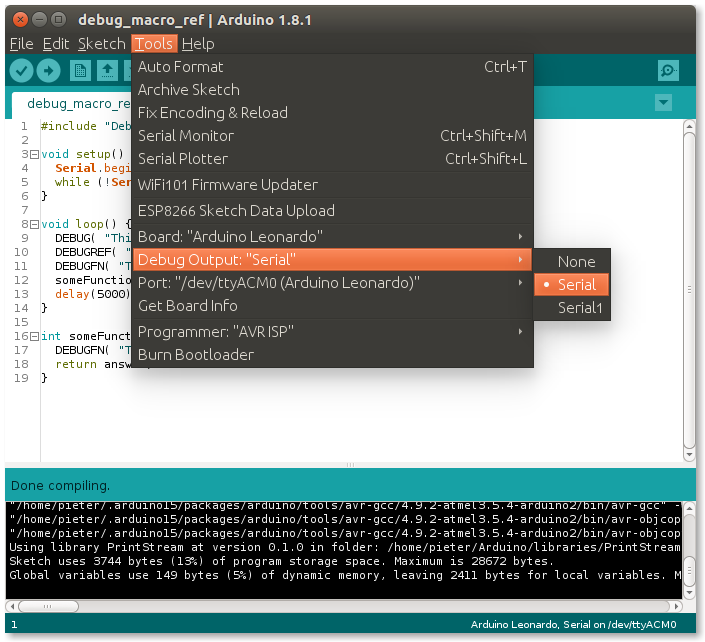

# Arduino Debugging

When working on an Arduino sketch or library, you often find yourself writing an awful lot of `Serial.print(...)` statements for debugging. It can be quite hard to keep track of where all of this data comes from, and it's a pain to remove or comment out all of it when preparing for a release.

This library aims at facilitating the debugging process by providing simple macros that add no overhead whatsoever when debugging is disabled. It can also automatically print out information about the context, like function name, filename and line number.

On top of that, it can be used for the Arduino, as well as desktop C++. This makes it easier to develop on your computer, run unit tests on your computer, and then compile for the Arduino using the exact same code.

## Dependencies

All that's needed is the [Arduino PrintStream library](https://github.com/tttapa/Arduino-PrintStream), that adds `std::cout`-like support for the Arduino (using the `<<`-operator).

## Installation

The easiest way is to just paste the `Debug.hpp` file into your sketch or project folder. If you're using the Arduino IDE, you can use `CTRL+L` (or _Sketch > Show Sketch Folder_) and paste it there.

## API

The library provides three macros:

1. `DEBUG(x)`  
This is the easiest one: it just prints out `x` to the debug output if debugging is enabled. It also terminates the line.
2. `DEBUGREF(x)`  
This one behaves similar to `DEBUG`, but it also prints out a reference to the filename and line number where it was called.
3. `DEBUGFN(x)`  
Rather than printing the entire filename, this one prints out just the function name and the line number where it was called.

## Example

```cpp
#include "Debug.h"

void setup() {
  Serial.begin(115200);
  while (!Serial);
}

void loop() {
  DEBUG( "This is the result of `DEBUG`" );
  DEBUGREF( "This is the result of `DEBUGREF`" );
  DEBUGFN( "This is the result of `DEBUGFN`" );
  someFunction(42);
  delay(5000);
}

int someFunction(int answer) {
  DEBUGFN( "The answer is " << answer);
  return answer;
}
```
When debugging is enabled the code above produces the following output:
```
This is the result of `DEBUG`
[/home/user/Arduino/Debug/Example.ino:10]:	This is the result of `DEBUGREF`
[void loop() @ line 11]:	This is the result of `DEBUGFN`
[int someFunction(int) @ line 17]:	The answer is 42
```

## Enabling debugging and selecting the output stream

The easiest way to enable debugging, is to define the output stream before including the `Debug.hpp` file:
```cpp
#define DEBUG_OUT Serial
#include "Debug.hpp"
```
These two lines will enable debugging to the output `Serial`.

If you want to disable debugging, just comment out (or remove) the first line. Now no output will be printed, and no overhead will be caused by your `DEBUG(...)` statements, because they will be removed before the compilation even starts.

## Adding a 'Debug' menu in the Arduino IDE (Optional)

If you are going to be debugging a lot, it might be usefull to just add a menu option in the IDE to disable/enable debugging.  
This can be easily done by editing the `boards.txt` file.

Open the `boards.txt` file of the board you are using. If you're using version 1.8.x of the Arduino IDE, it'll be located in `~/.arduino15/packages/<package-name>/hardware/<architecture>/<version>/` or `C:\users\<username>\AppData\Local\Arduino15\packages\<package-name>\hardware\<architecture>\<version>\`
Open it using a text editor (e.g. Gedit on Linux, or Notepad on Windows).

First, create the menu option by adding the following line at the top of the file:
```
menu.debug=Debug output
```

Then for your board, just add the different debug options.  
For example, if you're using an Arduino UNO:
```
uno.menu.debug.None=None
uno.menu.debug.None.build.debug_output=
uno.menu.debug.Serial=Serial
uno.menu.debug.Serial.build.debug_output=-DDEBUG_OUT=Serial
```
Then add the debugging to the compilation options by adding the line:
```
uno.build.extra_flags={build.debug_output}
```

If your board already has an `extra_flags` entry, just add ` {build.debug_output}` to the end (separated by a space).

A complete list of all the AVR boards and their added debug options can be found in [boards.txt.example](boards.txt.example).

Finally, restart the IDE.  
If you now open your the `Tools` menu in the Arduino IDE, you should see the debug options:

